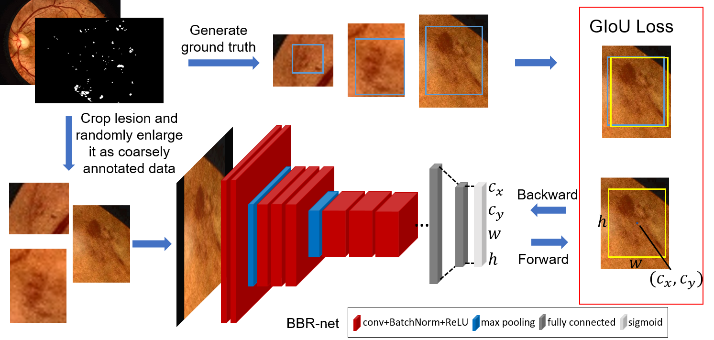

## BBR-net

This repository is the implementation of the paper published in ISBI2020: ***Automated Hemorrhage Detection from Coarsely Annotated Fundus Images in Diabetic Retinopathy***.




### Run

Organize your data in a csv file with format `path_to_img.JPG,x1,y1,x2,y2,class` for each lesion. For example:

```
img1.JPG,529,1796,596,1849,HEM
img1.JPG,692,1490,736,1530,HEM
img1.JPG,1922,170,1965,214,HEM
img2.JPG,1948,2013,2049,2107,HEM
img2.JPG,2354,1987,2442,2062,HEM
```

Then, replace the csv file path in `config.py`.

You can train the model by run:

```shell
$ python main.py
```


### Acknowledgements

The BBR-net is built on the torchvision implementation of the ResNet.


### Citation

```
@inproceedings{huang2020automated,
  title={Automated Hemorrhage Detection from Coarsely Annotated Fundus Images in Diabetic Retinopathy},
  author={Huang, Yijin and Lin, Li and Li, Meng and Wu, Jiewei and Cheng, Pujin and Wang, Kai and Yuan, Jin and Tang, Xiaoying},
  booktitle={2020 IEEE 17th International Symposium on Biomedical Imaging (ISBI)},
  pages={1369--1372},
  year={2020},
  organization={IEEE}
}
```

